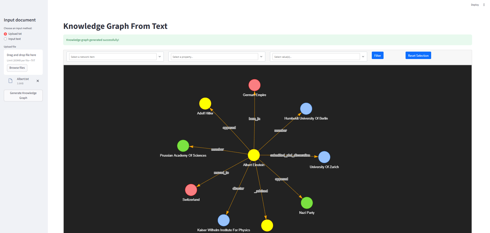

Okay here we are 
Knowledge Graph from Text using Local LLMs

This project generates a Knowledge Graph (KG) from input text using local LLMs (LLaMA 3.1 via LM Studio) and visualizes it in Streamlit.

🧠 What Is a Knowledge Graph?

A Knowledge Graph is a structured representation of information where:

Nodes represent entities (people, places, concepts, objects)

Edges represent relationships between entities

Attributes describe properties of nodes or edges

Example:

[Person: Alice] —(travels_to)→ [Place: Wonderland]

Knowledge Graphs help transform unstructured text → structured knowledge, enabling analysis, querying, and visualization.

🎯 Why Build a Knowledge Graph?

Summarize large documents into key entities and relationships

Find hidden connections between concepts

Support semantic search and reasoning

Enable analytics and knowledge discovery

In short: We convert messy text into structured, machine-readable knowledge.

⚙️ How This Project Works
1. Input Text

The user can:

Upload a .txt file

Enter text manually

2. LLM Extraction

The text is processed by a local LLM (via LM Studio), which extracts:

Entities

Relationships

Types

Example output from LLM:

Entities:
- "Alice" (Person)
- "Wonderland" (Place)

Relationships:
- Alice → travels_to → Wonderland

3. Graph Transformation

The extracted entities and relationships are converted into graph documents using LLMGraphTransformer.

4. Visualization

The graph is visualized with PyVis and saved as:

knowledge_graph.html

You can also save the graph in JSON, CSV, or Neo4j for further analysis.

🆚 LLM-Based KG vs Traditional NLP Systems
Feature	Traditional NLP	LLM-Based Extraction
Accuracy	High in domain-specific data	Flexible across domains
Setup	Needs training / rules	Ready to use
Complexity	Handles simple relationships	Handles complex and implicit relations
Speed	Fast runtime	Requires more compute
Flexibility	Low	High
Best Use Case	Domain-specific pipelines	Quick prototyping, general text

LLM-based extraction is ideal for flexibility, fast development, and cross-domain text.
